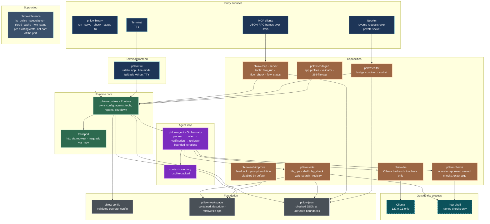
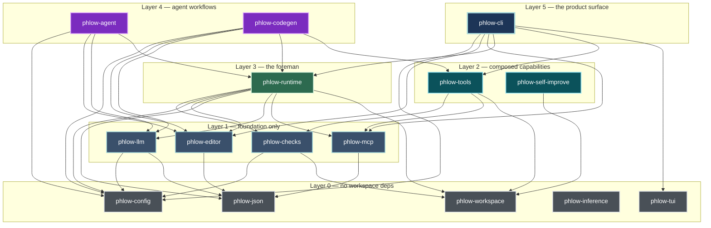
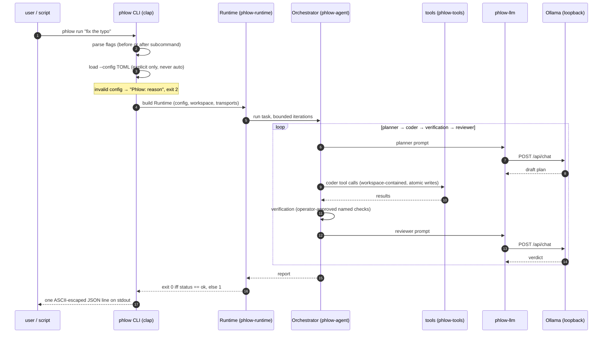
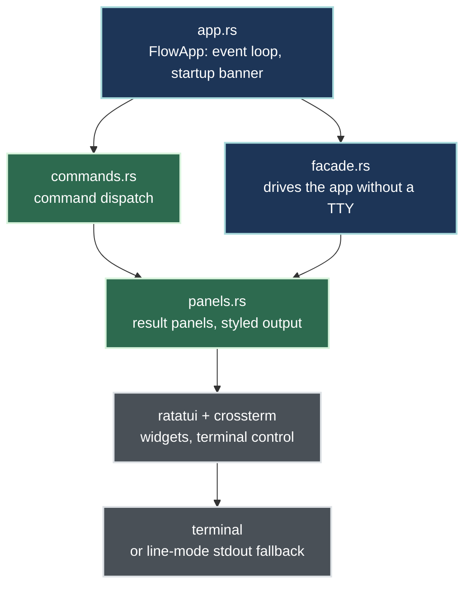

# Phlow Architecture

A map of the Rust workspace as it actually is: every node and edge below is
derived from the tree — the `Cargo.toml` workspace member list, each crate's
`path` dependencies, and the real module layout under `crates/*/src`. Nothing
here is aspirational; planned work (CLM scoring, tuios session/inbox concepts)
is tracked separately and this file will be updated as those integrations
land, with a final accuracy pass at the end of the program.

Derivation (re-run to check drift):

```sh
# workspace members
grep -A40 'members' Cargo.toml
# intra-workspace edges (path = "../..." deps)
grep -rn 'path = "\.\./' crates/*/Cargo.toml
# module layout
ls crates/*/src
```

The workspace is 15 crates: the 14 port crates plus `phlow-inference`, a
pre-existing supporting crate that is not part of the port and is not covered
by the Python-parity gates.

## System architecture

Top-to-bottom: entry surfaces, the runtime core, the agent loop, the
capability crates it drives, the foundation everything stands on, and the
processes outside the trust boundary.



Notes:

- The `flow` compatibility binary alias is gone; the only binary is `phlow`
  (`crates/phlow-cli/src/bin/phlow.rs`).
- The MCP tool names `flow_run`, `flow_check`, `flow_status` are deliberately
  **not** renamed: they are the wire contract existing clients speak. Renaming
  them would silently break clients; any rename needs a versioned migration.
- `phlow-inference` has no edges into the agent path — it is available as a
  supporting library, not wired into `run`/`serve`.

## Crate dependency layers

Direct `path` dependencies only, bottom-up. An edge `A → B` means "A lists B
under `[dependencies]` with `path = ...`". Transitive edges are real and
shown; nothing is elided.



Reading the layers:

- **Layer 0** is the bedrock: validated config, checked JSON, the contained
  workspace. `phlow-tui` and `phlow-inference` sit here because nothing in the
  workspace depends on their internals — the TUI is driven through its facade
  by `phlow-cli`, inference is standalone.
- **Layer 3 has exactly one crate.** `phlow-runtime` is the only crate allowed
  to own everything at once (config, agents, tools, reports, shutdown) — the
  one-owner rule made structural.
- **Layer 5 has exactly one crate.** All product surface goes through
  `phlow-cli`; there is no second way to build a `Runtime`.

## Data flow: `phlow run`



`status` and `check` skip the model entirely; `check` runs named checks
directly through `phlow-checks`.

## Data flow: `phlow serve` (MCP over stdio)

```mermaid
sequenceDiagram
    autonumber
    participant K as MCP client
    participant S as McpServer (phlow-mcp)
    participant R as Runtime (phlow-runtime)

    K->>S: {"jsonrpc":"2.0","id":1,"method":"initialize",...} (stdin line)
    S-->>K: {"jsonrpc":"2.0","id":1,"result":{...}} (stdout line)
    K->>S: {"jsonrpc":"2.0","id":2,"method":"tools/list",...}
    S-->>K: {"jsonrpc":"2.0","id":2,"result":{"tools":[...]}} (flow_run, flow_check, flow_status)
    K->>S: {"jsonrpc":"2.0","id":3,"method":"tools/call","params":{"name":"flow_run","arguments":{"task":"..."}}}
    S->>R: dispatch to Runtime (same path as CLI run)
    R-->>S: report
    S-->>K: {"jsonrpc":"2.0","id":3,"result":{...}}
    Note over K,S: EOF on stdin ends the session; Runtime closes on every exit path
```

One request line → one response line; frames are newline-delimited JSON-RPC.
`phlow-json` enforces input byte caps and depth limits at this boundary.

## TUI component stack



`phlow tui` renders the ratatui app when a TTY is present; without one the
facade falls back to line mode, so scripts never hang waiting for a terminal.

## Component responsibilities

Derived from each crate's `src/` module list.

| Crate | Modules | Responsibility |
|---|---|---|
| `phlow-cli` | `cli`, `signal`, `wiring`, `bin/phlow.rs` | The `phlow` binary: flags, exit codes, SIGTERM→130, wiring the Runtime |
| `phlow-runtime` | `runtime`, `prompt`, `report`, `tools`, `error`, `transport/{http,msgpack}` | The foreman: owns config, agents, tools, reports, shutdown; one owner per handle |
| `phlow-agent` | `orchestrator`, `context`, `memory` | The conveyor belt: bounded planner → coder → verification → reviewer; rusqlite memory |
| `phlow-llm` | `transport`, `payload`, `prompts`, `error` | Ollama backend: local model calls, loopback only |
| `phlow-tools` | `registry`, `file_ops`, `shell`, `lsp_check`, `web_search`, `json_compat`, `error` | Tool implementations + Python-compatible JSON serialization |
| `phlow-mcp` | `server`, `protocol`, `schema`, `json_ascii`, `error` | The MCP window: newline JSON-RPC frames over stdin/stdout |
| `phlow-editor` | `bridge`, `contract`, `socket`, `fake`, `error` | The private Neovim socket: reverse requests into the editor |
| `phlow-tui` | `app`, `facade`, `commands`, `panels` | The terminal frontend: ratatui with TTY, line mode without |
| `phlow-config` | `model`, `load`, `error` | Validated operator configuration: every struct is born checked |
| `phlow-workspace` | `workspace`, `error` | The channel bed: contained, descriptor-relative file operations |
| `phlow-json` | `lib` (single module) | Checked JSON narrowing at untrusted boundaries; hard caps |
| `phlow-checks` | `runner`, `disabled` | Operator-approved named checks, exact argv, run on the host |
| `phlow-codegen` | `app_generator`, `profiles`, `validator`, `error` | Code generation profiles (8 effective), 256-file cap |
| `phlow-self-improve` | `feedback`, `prompt_evolver`, `skill_store`, `error` | Feedback records and prompt evolution; disabled by default |
| `phlow-inference` | `kv_policy`, `speculative`, `tiered_cache`, `two_stage` | Inference-serving primitives (DeepSeek-V4.1-Flash ideas); supporting crate |

## Trust boundaries

1. **Stdin/stdout framing** (`phlow-mcp`, `phlow-json`): JSON-RPC lines from
   clients are untrusted input — byte caps, depth limits, typed errors, never
   panics.
2. **Tool arguments** (`phlow-tools`, `phlow-json`): model-supplied arguments
   are narrowed to the shapes each tool needs before anything acts on them.
3. **Workspace containment** (`phlow-workspace`): file tools operate
   descriptor-relative inside the workspace root; nothing escapes.
4. **Checks on the host** (`phlow-checks`): only operator-approved names with
   exact argv run outside containment.
5. **Editor socket** (`phlow-editor`): reverse requests into Neovim go over a
   private socket; `Rose/Phlow workspace mismatch` fails closed.
6. **Network** (`phlow-llm`, `transport/http`): the only network peer is the
   local model server on loopback.

## Keeping this document truthful

- Re-run the derivation commands at the top after any structural change and
  diff the result against the diagrams.
- When the CLM integration lands (contrastive scoring, bounded caches,
  best-of-N verifier), add its crates/modules to the capability layer and the
  dependency graph.
- When the tuios integration lands (agent states, inbox, JSON control
  protocol, hooks, session daemon), extend the entry-surface and TUI sections.
- The mdbook chapter `docs/book/src/architecture.md` is the ELI5 companion;
  keep the two consistent on crate roles and product naming.
